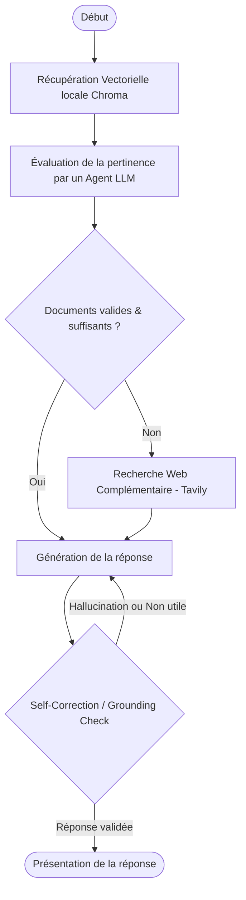

# Agentic CRAG (Corrective RAG) Workflow with LangGraph & Streamlit

Ce projet implémente une application d'**Agentic Retrieval-Augmented Generation (Corrective RAG)** avancée en utilisant **LangGraph**, **LangChain**, et **Google Gemini**.

L'application propose un flux de décision complet géré sous forme de graphe d'états asynchrone, avec fallback sur recherche web et correction automatique des hallucinations.

---

## ⚙️ Architecture du Graphe de Décision (CRAG)

Le workflow implémenté suit les étapes logiques suivantes :



1. **Retrieve** : Recherche sémantique dans la base de données vectorielle locale Chroma (contenant des documents techniques AcmeCorp).
2. **Grade Documents** : Un évaluateur LLM passe en revue chaque document extrait et le note comme pertinent ou non.
3. **Decide / Search** : Si des documents sont manquants ou non pertinents, l'agent déclenche automatiquement une recherche web complémentaire via l'API **Tavily** pour combler les manques.
4. **Generate** : Le LLM (Gemini 2.5 Flash) génère une synthèse finale à partir des données collectées.
5. **Self-Correction** : Un double censeur (Grounded Check & Usefulness Check) analyse la réponse pour détecter les hallucinations par rapport aux faits réels. Une garde anti-boucle limite l'auto-correction à 2 cycles maximum.

---

## 🛠️ Installation & Démarrage

### Prérequis
- Python 3.10+
- Un compte [Google AI Studio](https://aistudio.google.com/) pour obtenir une clé d'API **Gemini**.
- Une clé d'API [Tavily](https://tavily.com/) (Optionnelle, pour le fallback de recherche web).

### 1. Cloner le projet et installer les dépendances
```bash
# Installer les dépendances requises
pip install -r requirements.txt
```

### 2. Initialiser la base de données vectorielle locale
Avant de lancer l'application, vous devez peupler la base de données locale Chroma avec les documents techniques d'évaluation :
```bash
python seed_data.py
```

### 3. Lancer l'application interactive Streamlit
```bash
streamlit run app.py
```
L'interface sera disponible dans votre navigateur à l'adresse [http://localhost:8501](http://localhost:8501).

---

## 📂 Structure du Projet

* `app.py` : Interface Streamlit **dark tech** avec trace du pipeline affichée en direct (streaming node par node).
* `crag_engine.py` : Définition des états, des agents censeurs et de la logique de graphe LangGraph (cache des embeddings, garde anti-boucle, trace enrichie).
* `seed_data.py` : Script d'initialisation de la base vectorielle locale avec Chroma et HuggingFace embeddings.
* `.streamlit/config.toml` : Thème sombre forcé (évite les conflits light/dark du navigateur).
* `requirements.txt` : Liste des dépendances.

---

## 👥 Crédits & Co-développement
Ce projet a été développé en collaboration et en pair-programming avec l'assistant IA **Antigravity** de Google DeepMind.
